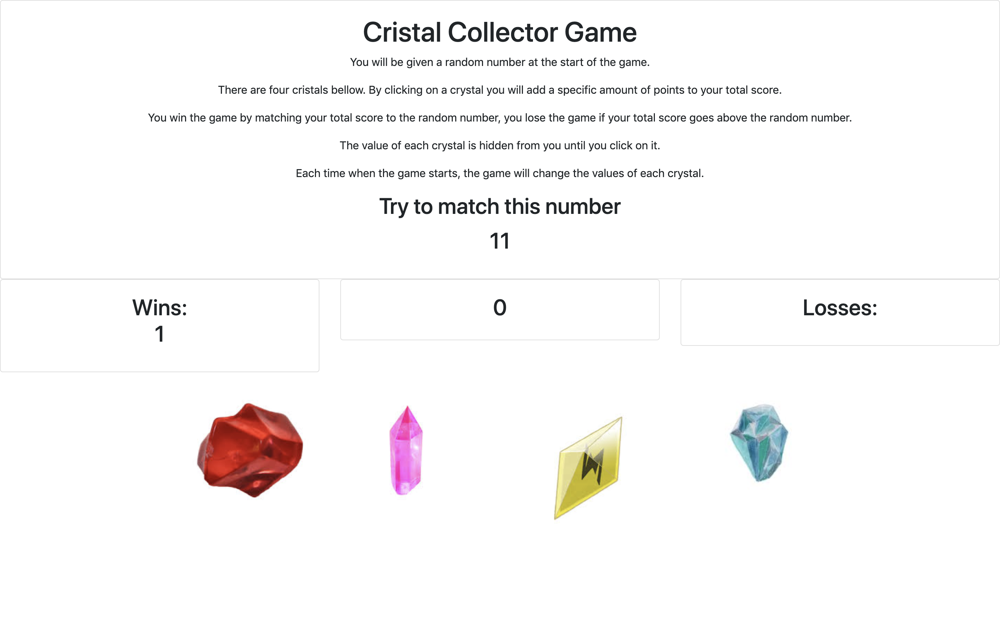

### Crystal Collector Game
--------------------
######  A random number is given  at the start of the game.

###### There are four cristals on the screen. By clicking on a crystal you will add a specific amount of points to your total score.

###### You win the game by matching your total score to the random number, you lose the game if your total score goes above the random number.

###### The value of each crystal is hidden from you until you click on it.

###### Each time when the game starts, the game will change the values of each crystal.
## Screenshot of the Game
------

---
## Technologies used on the project
## Technologies usen on the project
* Github
###### Github is a remote repository where we can store versions of our code.
* Gitlab
###### GitLab is a web-based DevOps lifecycle tool that provides a Git-repository manager providing wiki, issue-tracking and CI/CD pipeline features, using an open-source license, developed by GitLab Inc.
* HTML 5
###### HTML is a markup language tool where we write the text of our webpages. It Uses tags to organize the page in a  semantic meaning. Making easer to read and understand de structure of the page.
* JavaScript
###### JavaScript, often abbreviated as JS, is a high-level, interpreted scripting language that conforms to the ECMAScript specification. JavaScript has curly-bracket syntax, dynamic typing, prototype-based object-orientation, and first-class functions.
* Bootstrap
###### The world’s most popular framework for building responsive, mobile-first sites.
---
## This project had some very challenging logic. this piece of code represents one of them.
```javascript
 $(document).ready(function () {
    
    $(document).on("click", "#red-crystal", function () {
        crystalCount = randomRed + crystalCount
        $("#score-count").html("<h2>" + crystalCount + "</h2>");
```
---
> Author
 Alexei Dias
 Linkedin 
 https://www.linkedin.com/in/alexei-dias-b4054a164/